# SpatialScope User Manual

**Applies to:** SpatialScope 1.2.1 for macOS and SpatialScope 1.2.4 for Windows<br>
**Workflow:** image preparation → aligned channel CSV files → composite preview → nuclei → cell types → neighborhoods → regions → distribution → distances → exports

> The screenshots show the macOS interface with an example 16-channel dataset. Windows uses the same nine-stage analysis workflow and output contracts in a native WPF desktop layout, so control placement differs slightly. Marker names, colors, cell types, counts, and results will vary by dataset.

## Contents

- [1. What SpatialScope does](#1-what-spatialscope-does)
- [2. Before you begin](#2-before-you-begin)
  - [2.2 Citation](#22-citation)
  - [2.3 Create channel text images outside SpatialScope](#23-create-channel-text-images-outside-spatialscope)
- [3. Launching the app and understanding the interface](#3-launching-the-app-and-understanding-the-interface)
- [4. Quick-start workflow](#4-quick-start-workflow)
- [5. Step 1 — Inputs & Calibration](#5-step-1--inputs--calibration)
- [6. Step 2 — Composite Preview](#6-step-2--composite-preview)
- [7. Step 3 — Nuclei Segmentation](#7-step-3--nuclei-segmentation)
- [8. Step 4 — Cell Type Assignment](#8-step-4--cell-type-assignment)
- [9. Step 5 — Neighborhood Analysis](#9-step-5--neighborhood-analysis)
- [10. Step 6 — Region Analysis](#10-step-6--region-analysis)
- [11. Step 7 — Cell Distribution](#11-step-7--cell-distribution)
- [12. Step 8 — Distance Analysis](#12-step-8--distance-analysis)
- [13. Step 9 — Results & Exports](#13-step-9--results--exports)
- [14. Output directory reference](#14-output-directory-reference)
- [15. Reproducibility and data-management guidance](#15-reproducibility-and-data-management-guidance)
- [16. Troubleshooting](#16-troubleshooting)
- [17. Implementation and interpretation notes](#17-implementation-and-interpretation-notes)
- [18. Glossary](#18-glossary)

---

## 1. What SpatialScope does

SpatialScope is a nine-step spatial image-analysis application for aligned multiplex images stored as numeric CSV matrices. One CSV file represents one marker channel. The app can:

1. register channels and physical calibration;
2. create colored composite and split-channel previews;
3. detect nuclei;
4. classify cells from marker rules;
5. summarize local combinations of cell types on a spatial grid;
6. generate computational regions of interest (ROIs) and manually adjusted ROIs;
7. measure cells and neighborhood clusters relative to ROI boundaries;
8. calculate nearest-cell and cell-to-boundary distances; and
9. export figures, masks, tables, parameters, and metadata.

Before starting the in-app workflow, split and preprocess the original image channels and export each channel as a numeric `.csv` text image as described in [Section 2.3](#23-create-channel-text-images-outside-spatialscope).

The intended in-app order is left to right in the sidebar. You can open any step at any time, but most later steps require outputs from earlier steps.

| Step | Purpose | Required earlier result |
|---|---|---|
| 1. Inputs & Calibration | Choose folders, channels, colors, and scale | Prepared channel CSV files |
| 2. Composite Preview | Verify alignment and marker appearance | Detected CSV channels |
| 3. Nuclei Segmentation | Detect nuclear objects | Selected nucleus channel |
| 4. Cell Type Assignment | Apply marker-rule phenotypes | Final nuclei segmentation |
| 5. Neighborhood Analysis | Group occupied spatial tiles by cell-type presence | Final cell-type assignment |
| 6. Region Analysis | Build ROI masks and boundaries | Final cell-type assignment |
| 7. Cell Distribution | Build boundary bands and densities; macOS also exposes cluster distributions | Calibration, assignment, and regions; neighborhoods for the macOS cluster mode |
| 8. Distance Analysis | Measure cell-to-cell and cell-to-boundary distances | Assignment; saved region mask for boundary mode |
| 9. Results & Exports | Review all generated files | At least one saved output |

---

## 2. Before you begin

### 2.1 System requirements

- macOS 13 or later on Apple Silicon or Intel, or 64-bit Windows 10 or 11.
- A packaged SpatialScope `.app` or an installed Windows copy of SpatialScope.
- Enough RAM for all selected channel matrices and intermediate masks. Memory use grows with image width × image height × number of channels.
- Write permission for the selected output folder.

The packaged macOS application includes architecture-specific Cell Distribution helpers, and the Windows package includes a private frozen scientific engine. End users do not need to install Python, Conda, .NET, Electron, Streamlit, or the legacy companion project.

### 2.2 Citation

If SpatialScope supports your work, please cite Xu Z, Liu F, Ding Y, et al., "Unbiased niche labeling maps immune-excluded niche in bone metastasis," *Cell* (2026), [https://doi.org/10.1016/j.cell.2026.04.009](https://doi.org/10.1016/j.cell.2026.04.009). The complete author list and machine-readable citation are available in the repository's `CITATION.cff` file.

### 2.3 Create channel text images outside SpatialScope

SpatialScope does not split or preprocess the original microscopy image. First prepare one two-dimensional numeric image for each channel using ImageJ, Fiji, or comparable image-processing software.

```text
Multichannel image
    → split into individual channels
    → process each channel as needed
    → export each channel as a text image
    → place all .csv files in one folder
    → continue to SpatialScope Step 1
```

#### Example workflow in ImageJ or Fiji

1. Work from a copy of the original image and retain the unmodified source data.
2. Open the multichannel image in ImageJ or Fiji.
3. If the file contains Z slices or time points, first choose a biologically appropriate two-dimensional plane or projection. Apply the same choice to every channel.
4. Split the image into separate channel windows using **Image → Color → Split Channels**. The command separates RGB, composite, and hyperstack channels into individual images. See the [ImageJ Split Channels documentation](https://imagej.net/ij/docs/menus/image.html#split-channels).
5. Process each channel as scientifically appropriate. Examples include background correction, flat-field correction, denoising, artifact removal, and brightness or contrast adjustment.
6. Apply identical cropping, rotation, registration, and spatial resizing to every channel. All exported channels must retain the same width, height, orientation, and pixel-to-pixel alignment.
7. Document the processing applied to each channel. Avoid independently changing intensities merely to make channels look similar unless that normalization is part of the validated analysis method.
8. With one processed channel active, choose **File → Save As → Text Image**. Repeat this export for every channel. ImageJ saves a Text Image as a spreadsheet-compatible, tab-delimited numeric matrix; see the [ImageJ Text Image documentation](https://imagej.net/ij/docs/menus/file.html#save-as-submenu).
9. Give each exported file a descriptive marker name ending in `.csv`, such as `CD8A.csv`, `CD45.csv`, or `Ir191_nuclei.csv`. If the software produces a `.txt` extension, rename it to `.csv` without changing the tab-delimited contents. SpatialScope accepts tab-delimited values but scans only files whose names end in `.csv`.
10. Place all channel CSV files directly inside one input folder. Do not place them in per-channel subfolders.

> **Brightness and contrast:** In ImageJ, changing the Brightness/Contrast display range does not necessarily change the underlying pixel values. Text Image export writes the numeric pixel matrix, not simply the appearance on screen. If a brightness or contrast change must affect the analysis, use an appropriate operation that modifies the pixel data and verify the resulting values before export. See the [ImageJ Brightness and Contrast documentation](https://imagej.net/ij/docs/menus/image.html#adjust).

After all channels have been exported and checked, continue to [Section 5, Step 1 — Inputs & Calibration](#5-step-1--inputs--calibration).

### 2.3 SpatialScope input-file requirements

Create one folder containing one CSV file per imaging channel. SpatialScope scans only CSV files directly inside that folder; it does not scan subfolders.

Each CSV should be:

- a UTF-8, headerless, two-dimensional numeric matrix;
- rectangular, with the same row and column count as every other channel;
- aligned pixel-for-pixel with the other channels;
- free of row labels, column labels, metadata, quoted fields, or comments; and
- named so the filename stem is a useful starting marker name, for example `CD8A.csv` or `Ir191_nuclei.csv`.

Accepted separators are comma, tab, semicolon, or whitespace. Comma has the highest detection priority.

> **Important:** Empty or nonnumeric fields are read as zero, and short rows are padded with zero. A header is therefore not rejected; it becomes an unintended zero-valued row. Validate the CSVs before analysis.

All channel matrices used together must have identical dimensions. A mismatch is reported when an overlay or assignment is run, not when the folder is first scanned.

### 2.4 Know the physical image dimensions

Have these four values ready:

- full image width in micrometers, `X µm`;
- matrix width in pixels, `X px`;
- full image height in micrometers, `Y µm`; and
- matrix height in pixels, `Y px`.

SpatialScope calculates:

```text
pixel size X = X µm / X px
pixel size Y = Y µm / Y px
```

The pixel dimensions you enter are not checked against the CSV dimensions. Enter the actual matrix width and height; otherwise scale bars, areas, radii, and distances will be wrong.

### 2.5 Use a separate output folder for each dataset

For a new dataset, start with a new, empty output folder. Selecting an output folder that contains recognized SpatialScope results automatically imports the saved pipeline state on both platforms. On Windows, validated parameters, completed stages, previews, and exports are restored, while the folder selected in the current dialog remains the output destination. For an empty Windows output folder, scanning and configuration occur when you click **Rescan CSV Files** or **Save Configuration**. Reusing an old output folder resumes that run, so do not select it for a different dataset.

A safe order for a new analysis is:

1. choose or create the new output folder;
2. choose the input folder;
3. on Windows, click **Save Configuration** to scan and configure the selected data in the new output folder;
4. quit and reopen SpatialScope if you need a guaranteed clean in-memory session;
5. confirm or reselect the new output and input folders;
6. configure channels and calibration; and
7. run every downstream step again.

On macOS, selecting a different empty output folder clears the overlay previews but not every downstream result already held in memory. On Windows, selecting an empty output folder clears loaded history and invalidates downstream step statuses; selecting a folder with valid history restores that run and opens the latest completed step. Changing the input folder invalidates downstream results but does not immediately scan files. After changing datasets, treat any visible result as stale until you save the new configuration and rerun each step sequentially.

---

## 3. Launching the app and understanding the interface

### 3.1 Launch a packaged app

On macOS, open `SpatialScope.app` in Finder. On Windows, run `SpatialScope-Windows-x64-Setup.exe`, complete the installation, and launch SpatialScope from the Start menu or desktop shortcut. Follow the [installation guide](INSTALLATION.md) if Gatekeeper or Windows SmartScreen requests first-launch approval.

### 3.2 Launch from the source repository

From the repository root:

```bash
./script/build_and_run.sh
```

Alternatively, open the SpatialScope Xcode project, select the SpatialScope scheme, and run the macOS target.

On Windows, prepare and test the native source application from PowerShell:

```powershell
.\windows\run_native.ps1 setup
.\windows\run_native.ps1 test
.\windows\run_native.ps1 run
```

To build and validate the self-contained Windows installer, run:

```powershell
.\windows\build_native.ps1 -FullSmoke
```

### 3.3 Main interface

The app opens on **Inputs & Calibration**. The interface has:

- a left sidebar with the nine workflow steps;
- a progress indicator and status color for each step;
- a detail panel for the selected step;
- a bottom status bar for completion and error messages; and
- path fields and **Choose** buttons for selecting folders, plus a bottom status-bar button for revealing the output folder.

The sidebar status is a workflow indicator, not a scientific validation guarantee. A completed configuration step confirms that the app accepted the saved settings; it does not prove that calibration values, marker names, colors, or channel selections are scientifically correct.

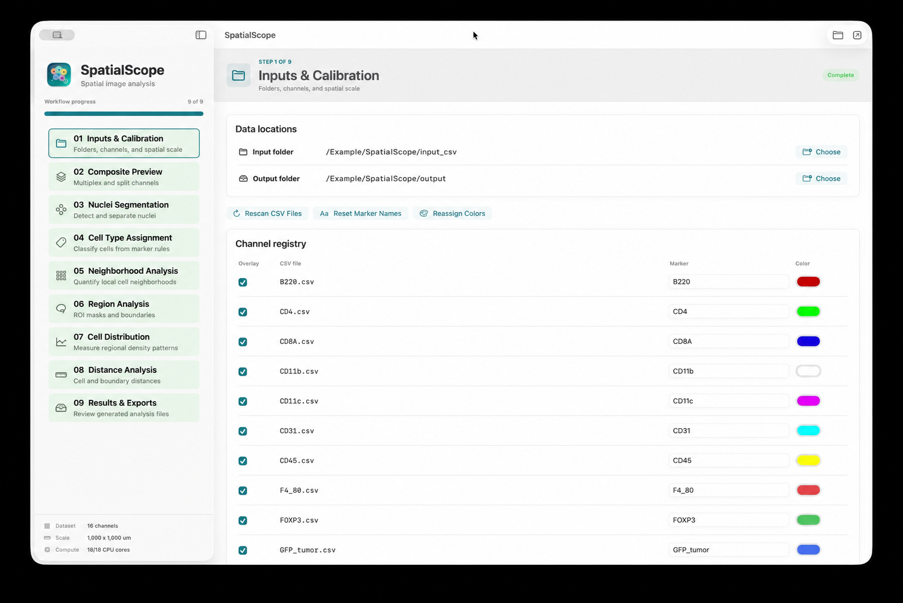

*Figure 1. The nine-step sidebar and the Step 1 channel registry. The displayed marker names and colors are editable. This example shows a completed workflow, so all nine steps are marked complete.*

### 3.4 Useful interface behavior

- Click any sidebar step to open it.
- Use the sidebar **Language/语言** control to follow the operating-system language or explicitly select English or Simplified Chinese. The preference changes UI text only; it does not change the `SpatialScope` name or any exported data, filenames, schemas, analysis parameters, or generated figures.
- Use **Command-O** on macOS to choose an input folder. On Windows, click the input or output path field or its **Choose** button to open the native folder browser.
- On macOS, use **Command-R** to generate the overlay. On Windows, select the overlay command in Step 2.
- On macOS, image previews can be scrolled when zoomed, pinch-zoomed from approximately 0.08× to 16×, and double-clicked to reset to fit.
- On Windows, plain mouse-wheel movement scrolls the page. Place the pointer over a plot and hold **Ctrl** while using the mouse wheel to zoom. Drag to pan while zoomed; double-click or press **0** to fit the image again. The **+**, **-**, and arrow keys provide keyboard zoom and pan after the plot receives focus.
- The bottom **Open Output** button reveals the current output folder; it does not choose a different output folder.
- Errors appear in the status bar rather than in a modal dialog.
- There is no visible Cancel button in the current interface. Wait for a running operation to finish before starting another.

---

## 4. Quick-start workflow

Use this checklist for a standard full run:

1. Outside SpatialScope, split the original image into individual channels, perform the required channel processing, and export every channel as a Text Image file with a `.csv` extension.
2. In **Inputs & Calibration**, choose a new output folder and the CSV input folder.
3. Verify channel names, overlay checkboxes, colors, and the four calibration fields. Save the configuration.
4. In **Composite Preview**, generate the overlay and inspect both the overlay and split channels.
5. In **Nuclei Segmentation**, choose the nucleus channel. Tune parameters manually or screen combinations, then run the final segmentation.
6. In **Cell Type Assignment**, define and save marker rules. Tune or screen assignment parameters, then run the final assignment.
7. In **Neighborhood Analysis**, choose a square size and run the analysis.
8. In **Region Analysis**, select ROI-defining cell types, tune ROI morphology, and run ROI identification. Optionally create adjusted ROIs and customized figures.
9. In **Cell Distribution** on Windows 1.2.4, choose a saved Region boundary, band width, and one or more cell types, then run once to generate both the boundary-band map and linked density plot. On macOS, generate Region masks before Cell density; the separate Cell cluster distribution tab also requires Neighborhood Analysis.
10. In **Distance Analysis**, run nearest-neighbor and/or boundary-distance analyses.
11. In **Results & Exports**, refresh the list and reveal the output folder.

At each final result, inspect the image and tables before proceeding. Screening recommendations optimize internal counts and should not be accepted without visual and biological validation.

---

## 5. Step 1 — Inputs & Calibration

### 5.1 Choose the data locations

1. Open **01 Inputs & Calibration**.
2. Under **Data locations**, click **Choose** beside **Output folder** and select a new output folder for this dataset.
3. Click **Choose** beside **Input folder** and select the folder containing the channel CSVs. macOS scans it immediately; on Windows click **Rescan CSV Files** or **Save Configuration** to scan and configure it. If the selected output folder already contained valid Windows results, that history was loaded automatically before this step.
4. After the scan completes, confirm that the status bar reports the expected number of CSV channels.

If files were added after the folder was selected, click **Rescan CSV Files**.

### 5.2 Configure the channel registry

Review every row:

| Column | What it controls |
|---|---|
| Overlay | Whether the channel contributes to the composite overlay |
| CSV file | The detected source file; read-only |
| Marker | The user-facing marker name used throughout the analysis |
| Color | The display and export color for that channel |

Helpful buttons:

- **Reset Marker Names** restores marker names from filename stems.
- **Reassign Colors** generates a different palette.
- Click a marker color swatch to open the native color picker on either platform. Windows shows the color itself rather than an editable hexadecimal code.

Use consistent, unique marker names. Marker-rule matching later ignores case and nonalphanumeric punctuation, so `CD-3`, `CD_3`, and `CD3` are treated as the same name.

> If at least one Overlay box is selected, only selected channels enter the composite. If every box is cleared, the app falls back to using all channels. Clearing all boxes does not create an empty overlay.

The split-channel preview always includes every loaded channel, regardless of these checkboxes.

### 5.3 Enter spatial calibration

Under **Spatial calibration**:

1. Enter the full physical image width in **X um**.
2. Enter the CSV matrix width in **X px**.
3. Enter the full physical image height in **Y um**.
4. Enter the CSV matrix height in **Y px**.
5. Confirm that the line below the fields displays the expected figure resolution.

The UI writes `um`, which means micrometers (`µm`). All four values must be greater than zero for calibration to be active.

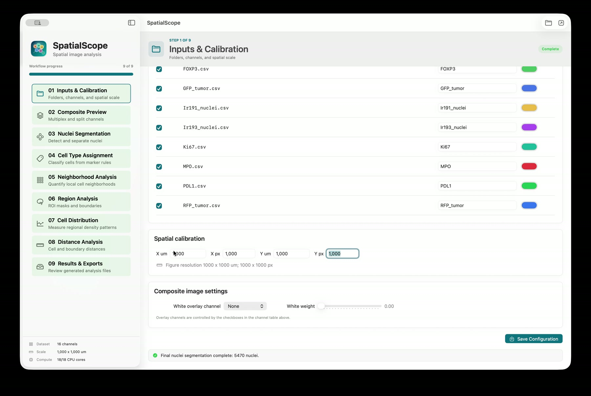

*Figure 2. Spatial calibration and the optional white-overlay controls for an example 1,000 µm × 1,000 µm field represented by 1,000 × 1,000 pixels.*

Most morphology modules use the geometric-mean scale `sqrt(pixelSizeX × pixelSizeY)` for scalar radii. Distance Analysis and the Cell Distribution Python workflow preserve X/Y anisotropy for Euclidean distances. If the X and Y pixel sizes differ greatly, treat scalar morphology radii as approximations.

Without calibration, most native steps use 1 µm/pixel. Cell Distribution refuses to run. Enter correct calibration before starting any analysis.

### 5.4 Configure the optional white overlay

Under **Composite image settings**:

1. Leave **White overlay channel** at **None** unless one channel should also be rendered in white.
2. If used, choose the channel and set **White weight** from 0.00 to 1.00 in 0.05 increments.

The chosen channel contributes once in its configured color and again in white. Use a low weight first to avoid washing out other colors. When any Overlay boxes are selected, the white channel must be one of them. When every Overlay box is cleared, the all-channels fallback includes the white channel automatically.

### 5.5 Save the configuration

Click **Save Configuration**. This creates `00_config/pipeline_config.json` and the output directory structure.

The configuration records absolute input/output paths, channels, colors, calibration, selected nuclei/assignment run modes and parameters, and resource settings. It does not store marker rules, Neighborhood grid size, Region parameters, Cell Distribution settings, or Distance selections; those are written to their separate configuration or run files. Saving configuration does not run the later analyses.

---

## 6. Step 2 — Composite Preview

### 6.1 Generate the composite

1. Open **02 Composite Preview**.
2. Click **Load Inputs and Generate Overlay**.
3. Wait until the status bar says that overlay and split-channel previews were saved.
4. Inspect the colored composite for:
   - spatial alignment across markers;
   - unexpectedly bright or dark channels;
   - missing channels;
   - wrong marker colors or names; and
   - a plausible scale bar.

Each channel is clipped at its 99.8th intensity percentile, normalized, colored, and combined with screen-style additive blending. The overlay annotates up to 14 channel labels. Its nominal 20 µm scale bar uses X-axis calibration.

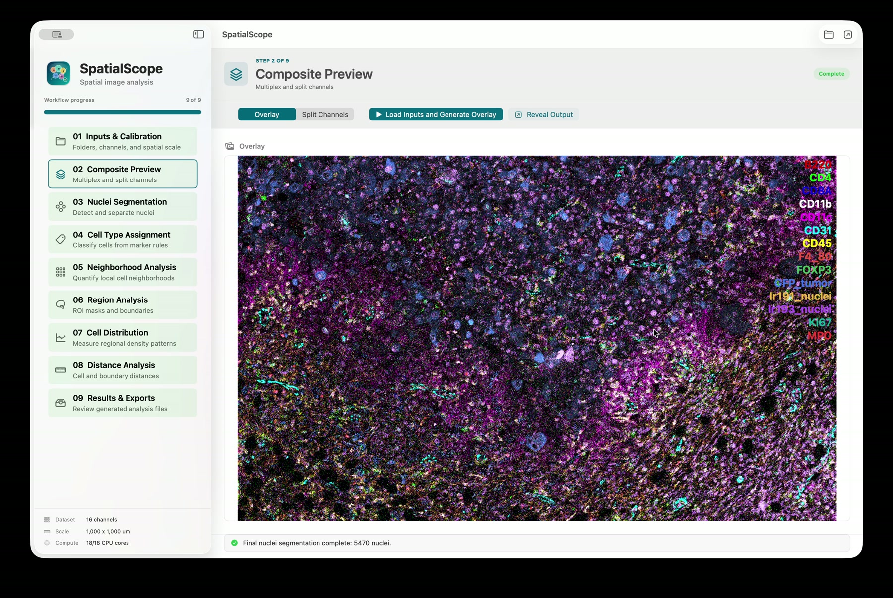

*Figure 3. Composite overlay for an example dataset. Marker labels appear in their configured colors.*

### 6.2 Inspect split channels

Select **Split Channels** in the segmented control. Review individual marker panels to identify:

- channel-specific noise;
- saturation;
- broad background;
- alignment problems; and
- markers that should be excluded from the overlay.

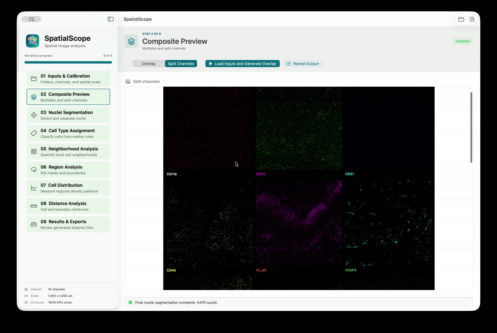

*Figure 4. Split-channel view. All loaded channels appear here, including channels excluded from the composite.*

If something is wrong, return to Step 1, correct the registry or source data, save the configuration, and regenerate the overlay. If you renamed a marker after saving cell-type rules, revisit **Cell Type Assignment → Marker Rules**, update and resave those rules before rerunning assignment and all downstream analyses. Use **Reveal Output** to open the folder containing the generated figures.

There is no **Save and Next** button in this step. Continue using the sidebar.

---

## 7. Step 3 — Nuclei Segmentation

### 7.1 Choose the nucleus channel

1. Open **03 Nuclei Segmentation**.
2. In **Nucleus Channel**, choose the channel with the clearest nuclear signal.

The app initially guesses a channel whose name contains `dapi`, `hoechst`, `nuclei`, `nucleus`, `nuclear`, `ir191`, or `ir193`. Confirm the choice rather than relying on the guess.

### 7.2 Choose Manual or Advanced Screening

- **Manual** uses the parameters exactly as displayed.
- **Advanced Screening** samples combinations on a reduced-resolution image, recommends a high-count result, and lets you apply another screened combination.

For a familiar assay, begin in Manual mode using a validated parameter set. For a new dataset, screening can provide candidates, but it is not a substitute for visual quality control.

### 7.3 Nuclei parameter reference

| UI parameter | Default | Range / step | Effect in this build |
|---|---:|---:|---|
| Minimum diameter (um) | 6.0 | 0–240 / 0.5 | Raises or lowers the minimum accepted connected-component area. Increase to reject small fragments. |
| Maximum diameter (um) | 60.0 | 1–320 / 1 | Controls the maximum accepted component area. Increase to retain larger connected objects or clumps. |
| Top-hat radius (um) | 2.0 | 0–40 / 0.5 | Sets the radius of a box-blurred background estimate that is subtracted from the normalized image. |
| Gaussian sigma (um) | 0.5 | 0–10 / 0.1 | Sets a second box-blur radius. Increase to suppress fine noise; excessive values blur small nuclei together. |
| Local window (um) | 25.0 | 1–240 / 1 | Saved and screened, but currently not used by the final segmentation calculation. |
| Local threshold offset | -0.03 | -1–1 / 0.01 | Directly changes the global threshold factor. Higher values are stricter; more negative values usually detect more foreground. |
| H-maxima (um) | 0.25 | 0–10 / 0.05 | In the current build, raises the global threshold factor; it does not run an H-maxima transform. |
| Minimum seed distance (um) | 0.1 | 0–20 / 0.1 | In the current build, raises the global threshold factor; it does not create or space watershed seeds. |
| Watershed compactness | 0.5 | 0–10 / 0.05 | In the current build, raises the global threshold factor; it does not invoke a compact watershed. |
| Post-resplit multiplier | 0.5 | 0–10 / 0.05 | Lowers the global threshold factor as it increases; it does not perform a post-watershed resplit. |

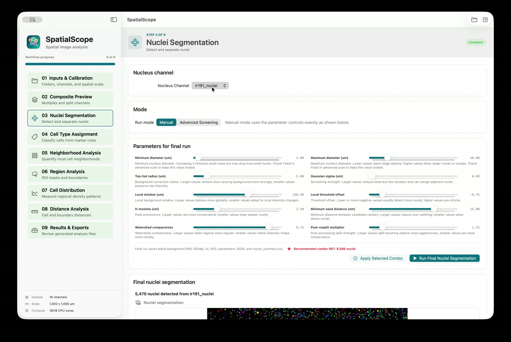

*Figure 5. Manual nuclei parameters and the final-run action.*

The current segmentation implementation normalizes the selected channel, subtracts a box-blurred background, applies a second box blur, calculates one global threshold, and accepts four-connected foreground components within diameter-derived area limits. It does not split a connected foreground clump into multiple nuclei.

The diameter fields are converted to permissive area limits rather than applied as literal equivalent-diameter cutoffs. With `s = sqrt(pixelSizeX × pixelSizeY)`, the implementation uses:

```text
rmin = max(0.5, minimumDiameter / (2s))
rmax = max(rmin, maximumDiameter / (2s))
minimumArea = max(1, floor(π × rmin² × 0.35))
maximumArea = max(minimumArea, floor(π × rmax² × 1.75))
```

If the entered minimum diameter exceeds the maximum, the build does not reject the settings; it coerces the effective maximum radius up to the minimum radius. Avoid that configuration. After conversion to pixels, the nuclei top-hat/background radius is capped at 30 px and the second blur radius at 12 px, so the upper part of a UI slider can stop having additional effect at some calibrations.

Practical tuning guidance:

| Observed problem | Parameters to try | Caution |
|---|---|---|
| Many tiny fragments | Increase minimum diameter; increase threshold offset or H-maxima | Do not remove genuinely small nuclei |
| Many weak false positives | Increase threshold offset; increase blur slightly | Stricter thresholds can lose dim nuclei |
| Dim nuclei are missing | Make threshold offset more negative; reduce blur or H-maxima | Noise may increase |
| Very large connected objects are retained | Reduce maximum diameter | The whole clump may be rejected rather than split |
| Nearby nuclei form one connected object | Reduce blur and inspect threshold controls | Current code has no literal watershed separation |

### 7.4 Run Advanced Screening

In **Advanced Screening**:

1. Set **CPU allocation**. It ranges from 10% to 100% in 5% steps and controls the maximum worker count for nuclei and assignment work.
2. Leave **Fix minimum diameter** and **Fix maximum diameter** checked if those sizes are known. Uncheck either to include it in the search.
3. Set **Combinations to run**. The default is 160; the minimum is 10. This value is a number of combinations, not a number of minutes.
4. Review the estimated time and worker count.
5. Click **Run Advanced Screening**.

With both diameters fixed, the full theoretical search contains 390,625 combinations. Unlocking one diameter expands it to 1,953,125; unlocking both expands it to 9,765,625. The app runs only the requested budget using coarse and refined sampling.

Screening uses a nearest-neighbor downsample whose maximum dimension depends on the CPU-allocation setting, approximately `360 + 4.2 × CPU%`. Changing CPU allocation can therefore change the screening image as well as the speed. The unused Local-window value is still included in the search and consumes part of the combination budget even though it does not change the final segmentation calculation.

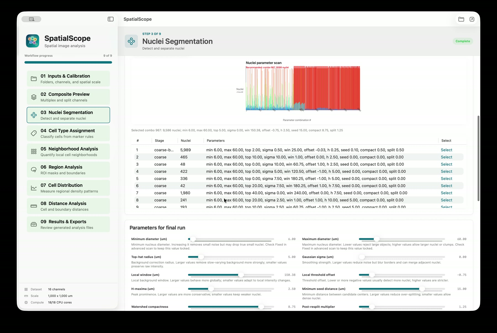

*Figure 6. Advanced nuclei scan plot, screened combinations, and the parameter panel for the final run.*

The table reports combination number, stage, detected-nuclei count, and parameter values. The recommended combination is the one with the greatest detected count. At scan completion, review the recommendation and explicitly apply it before the final run; screening does not change final-run parameters by itself. On Windows, click **Apply the suggested combo to final run**. On macOS, use **Apply Selected Combo**.

To use another candidate:

1. click **Select** on its row;
2. click **Apply Selected Combo**; and
3. confirm that the final-run sliders changed.

> **Validation warning:** Maximum detected count is not ground-truth segmentation accuracy. It can favor fragments and false positives. Inspect representative dense, sparse, bright, and dim areas before accepting a combination.

### 7.5 Run the final segmentation

1. Confirm the final-run parameter values.
2. Click **Run Final Nuclei Segmentation**.
3. Inspect the colored object map at multiple locations and zoom levels.
4. Check the reported count against biological expectations and, if possible, a manually counted subset.
5. Click **Save and Next** to open Step 4.

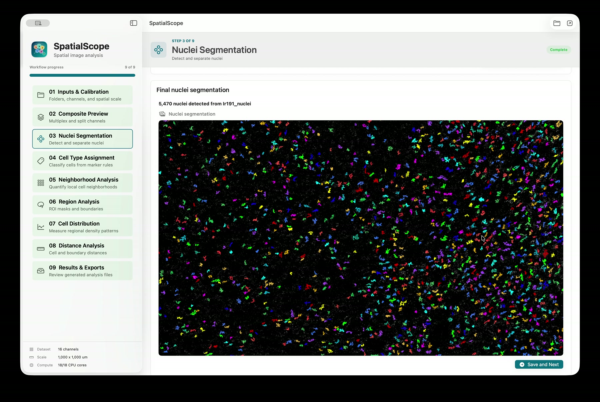

*Figure 7. Final full-resolution nuclei segmentation. Each accepted connected component is shown in a distinct color.*

The final run already writes the outputs. **Save and Next** only navigates; it does not perform another save.

---

## 8. Step 4 — Cell Type Assignment

Step 4 has two tabs: **Marker Rules** and **Screening & Assignment**.

### 8.1 Define marker rules

Open **Marker Rules**. Each cell-type row contains:

| Field | Logical meaning |
|---|---|
| Name | Unique cell-type label used in tables, masks, figures, and downstream selectors |
| Color | Cell-type display color |
| All positive | Every selected marker must be positive |
| All negative | None of the selected markers may be positive |
| Any-positive groups | At least one marker in the group must be positive |

`Nucleus` is a generated marker from the final nuclei segmentation, not an input CSV. Newly added cell-type rows normally preselect `Nucleus` under **All positive**; confirm that selection and then add the phenotype-specific markers.

Example rule:

```text
Name: CD8 T
All positive: Nucleus, CD8A
All negative: CD4
Any positive: CD45, CD3
```

This means the nucleus and CD8A must be positive, CD4 must not be positive, and at least one of CD45 or CD3 must be positive.

In the visible menu UI, all markers selected under **Any positive** form one OR group. The engine can represent multiple newline-separated groups, but the current menu does not provide a way to create multiple groups.

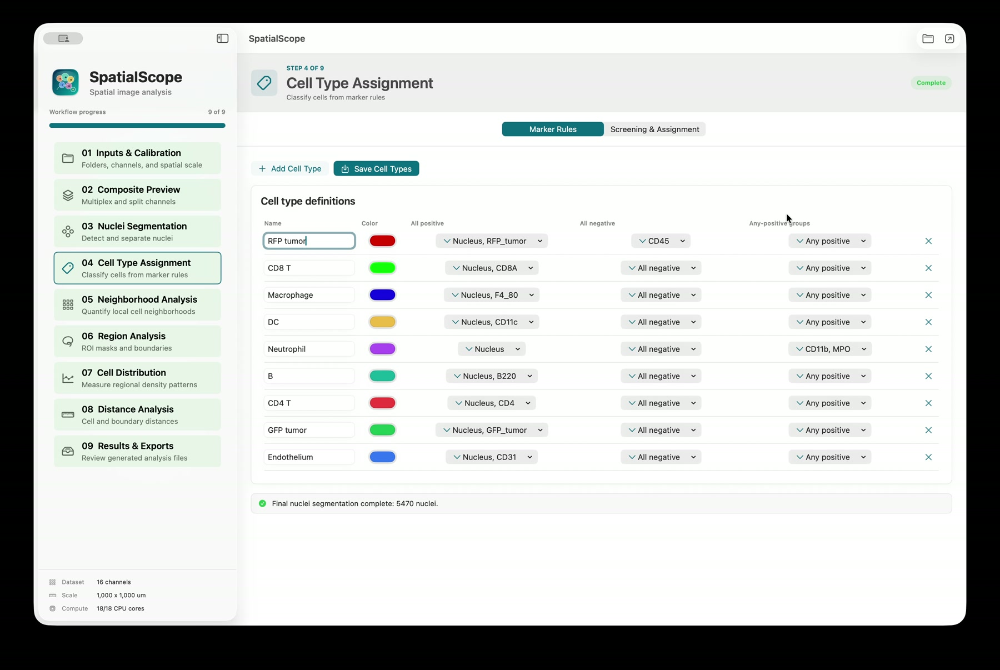

*Figure 8. Cell-type names, colors, required markers, excluded markers, and any-positive choices.*

To configure rules:

1. Edit the default rows or click **Add Cell Type**.
2. Give every cell type a nonblank, unique name.
3. Choose a color.
4. Select required markers under **All positive**.
5. Select exclusion markers under **All negative**.
6. Select an optional OR group under **Any positive**.
7. Use the `×` button to remove an unwanted row.
8. Click **Save Cell Types**.

Marker matching is case-insensitive and ignores punctuation and spaces. Avoid names that become identical after normalization. Every cell-type name must be nonblank and unique: an exact duplicate name can cause the current build to stop with a runtime precondition failure.

Each usable cell-type rule must also contain at least one positive requirement: an **All positive** marker or at least one **Any positive** marker. A rule made only from **All negative** markers can never become eligible. Selecting `Nucleus` as an All-positive requirement satisfies this constraint.

Rule outcomes:

- If no cell-type rule is eligible, the cell is **Unassigned**.
- If exactly one rule is eligible, that type is assigned.
- If multiple rules are eligible, ambiguity settings determine whether the strongest type wins or the cell remains **Ambiguous**.

### 8.2 Assignment parameter reference

Open **Screening & Assignment**.

| UI parameter | Default | Range / step | Meaning and tuning effect |
|---|---:|---:|---|
| `R_VORONOI_UM` | 3.0 | 0–300 / 1 | Maximum ownership radius around each nucleus. Larger values let more surrounding marker pixels belong to a nucleus but can increase cross-cell spillover. |
| `R_BUFFER_UM` | 2.0 | 0–300 / 1 | Expands nucleus labels to identify contested boundary zones and candidate nuclei. It does not independently admit marker pixels beyond `R_VORONOI_UM`. |
| `R_VOTE_UM` | 3.0 | 0–300 / 1 | Radius over which marker intensity votes among candidate nuclei. Larger values stabilize broad signal but reduce locality. |
| `TOPHAT_R_UM` | 1.0 | 0–150 / 1 | Box-blurred background-subtraction radius for marker channels. |
| `GAUSS_SIGMA_UM` | 0.5 | 0–75 / 0.5 | Box-blur radius before marker thresholding. More smoothing suppresses speckle but can erase small positives. |
| Threshold mode | Global Otsu | Global Otsu, Local, Yen | Otsu is the default. Yen is a distinct alternative. In the current build, Local uses the same threshold as Global Otsu. |
| Minimum positive-object size (px) | 9 | 0–50,000 / 1 | Removes connected positive-marker objects smaller than this size. |
| Minimum positive pixels | 5 | 0–50,000 / 1 | Required positive-marker pixels in the cell’s sampled territory. Zero means any positive pixel is sufficient. |
| Resolve ambiguous cells | On | On / Off | Permits a winner when several rules match. If off, multiple eligible rules remain Ambiguous. |
| Minimum winning probability | 0.60 | 0–1 / 0.01 | Minimum relative heuristic score for the best eligible rule. |
| Minimum probability gap | 0.10 | 0–1 / 0.01 | Minimum difference between the best and second-best relative scores. |

Assignment “probabilities” are normalized heuristic evidence scores, not calibrated biological probabilities or statistical confidence values.

The implementation caps several radii after converting micrometers to pixels: assignment top-hat at 160 px, the second blur at 32 px, and voting/buffer candidate-search disks at 24 px. `R_VORONOI_UM`, `R_BUFFER_UM`, and `R_VOTE_UM` become at least 1 px even when the UI value is 0 µm. At a given calibration, increasing a slider beyond its effective cap may therefore make no additional change.

The marker evidence columns saved in the assignment CSV are named as marker means in the internal model, but matrix-marker values represent positive-pixel evidence counts rather than mean intensities.

### 8.3 Run assignment Advanced Screening

Advanced Screening evaluates a subset of the image and searches for parameters that reduce unresolved cells.

1. Select **Advanced Screening**.
2. Set **CPU allocation**.
3. Choose a **Screening subset**:
   - **Random 3 bands** uses three highlighted vertical sections. On a fresh launch it initially highlights sections 1, 3, and 5; click **Shuffle** (or change a relevant mode/count) to randomize the set.
   - **Odd bands** uses visible sections 1, 3, and 5.
   - **Even bands** uses visible sections 2, 4, and 6 when six sections are used.
4. Choose 5 or 6 vertical sections.
5. Check **Fix Voronoi radius** and/or **Fix buffer radius** if those current values should remain unchanged.
6. Set **Combinations to run**. The default is 20 and the minimum is 10.
7. Click **Run Advanced Screening**.

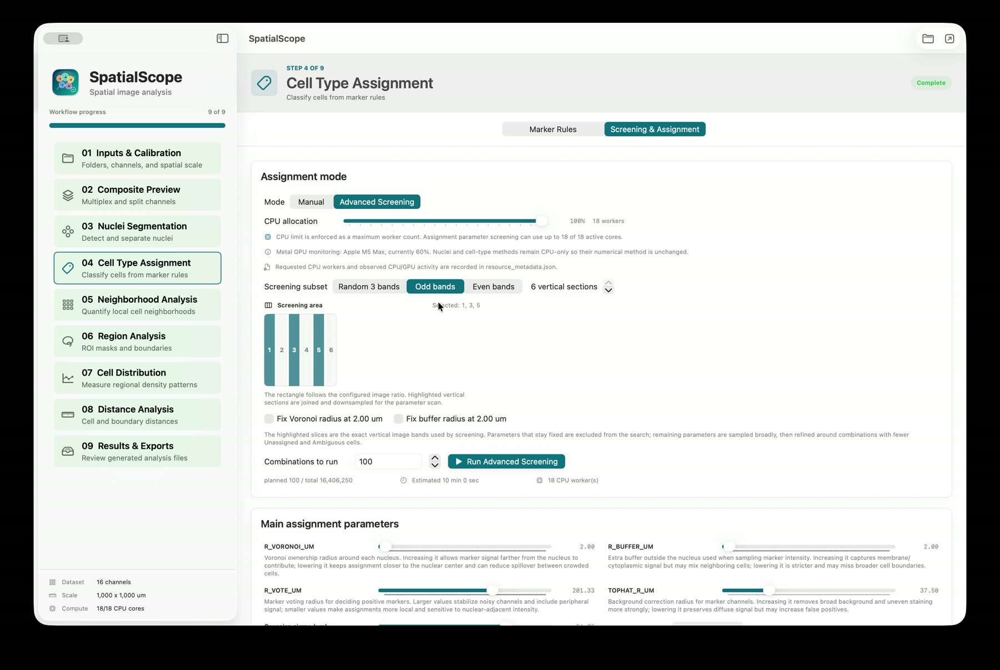

*Figure 9. Advanced assignment screening, including highlighted vertical image bands and fixed-parameter choices.*

With neither Voronoi nor buffer radius fixed, the theoretical search has 16,406,250 combinations. Fixing one reduces it to 3,281,250; fixing both reduces it to 656,250. The requested budget samples this space rather than exhaustively running it.

For speed, assignment screening can downsample the image by 4× or 2×, deterministically caps the evaluated sample at 1,000 nuclei, and extrapolates unresolved counts to the full nucleus count. Treat those figures as screening estimates rather than exact final-run counts.

The recommendation prioritizes:

1. fewer total unresolved cells;
2. fewer Ambiguous cells;
3. fewer Unassigned cells; and
4. more assigned cells.

Screening reports suggested values without changing the final parameter panel. On Windows, click **Apply the suggested combo to final run** after reviewing the recommendation. On macOS, select the desired row and click **Apply Selected Combo**.

> A low unresolved count can result from aggressive overassignment. Compare candidate maps against known marker biology. Check cells at phenotype boundaries and in crowded regions.

### 8.4 Run the final assignment

1. Confirm that cell-type rules were saved.
2. Confirm the final parameters.
3. Click **Run Final Assignment**.
4. Inspect the assignment map for plausible spatial and marker patterns.
5. Review assigned, Unassigned, and Ambiguous counts.
6. Review the cell-type count plot and table.
7. Click **Save and Next** to open Neighborhood Analysis.

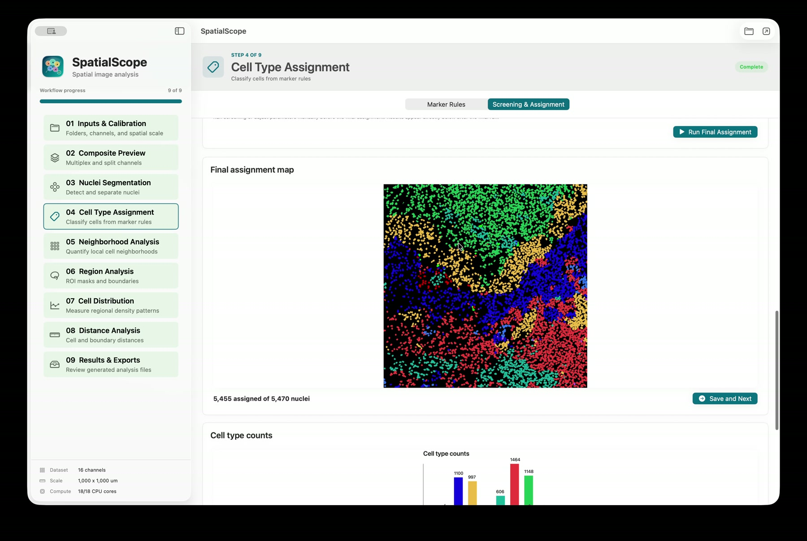

*Figure 10. Final assignment map and cell-type counts for an example dataset.*

As in Step 3, the final run already saves the result; **Save and Next** only changes screens.

The colored cell outlines are estimated territories, not segmented cell membranes. The current implementation samples 40 radial rays, applies marker-support thresholds, smooths the outline three times, and falls back to a circle when needed. The exported 16-bit cell-type mask and later Region Analysis masks inherit these heuristic territories; do not interpret their areas or edges as direct membrane measurements.

---

## 9. Step 5 — Neighborhood Analysis

Neighborhood Analysis divides the image into a fixed grid and records the cell types present in each occupied square.

### 9.1 Run the analysis

1. Open **05 Neighborhood Analysis**.
2. Set **Neighborhood square size UM**. The default is 20 µm; the range is 1–200 µm in 1 µm steps.
3. Click **Run Neighborhood Analysis**.
4. Inspect the map, number-to-cluster key, and statistics.

Tile size is calculated separately for X and Y from the spatial calibration. The grid begins at the top-left of the image; edge tiles may be smaller. A cell belongs to the tile containing its centroid.

**Unassigned** and **Ambiguous** cells are excluded.

### 9.2 Interpret a neighborhood cluster

A cluster is the alphabetically sorted set of assigned cell types present in a tile. It is not a machine-learned cluster and does not encode abundance.

For example, both of these tiles receive the same cluster label:

```text
Tile A: 1 macrophage + 1 T cell
Tile B: 20 macrophages + 1 T cell
Cluster label for both: Macrophage + T cell
```

The tile’s **dominant type** is its most abundant type; alphabetical order breaks a tie. Cluster IDs are assigned after sorting by the number of types and then alphabetically.

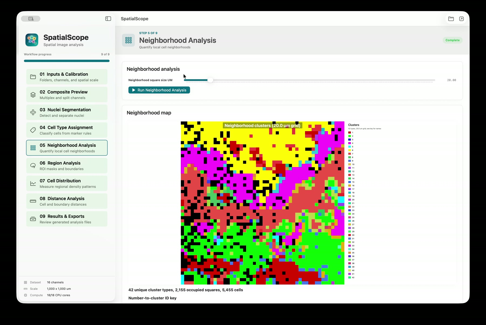

*Figure 11. Neighborhood cluster map and the numeric cluster legend.*

The statistics table reports:

- **Number:** cluster ID;
- **Cluster type:** the set of cell types present;
- **Tiles:** occupied tiles with that exact set;
- **Cells:** cells contained in those tiles; and
- **Tile fraction:** cluster tiles divided by all possible grid tiles, including empty tiles.

Click **Shuffle Colors** if cluster colors are difficult to distinguish. This changes only visualization colors, not cluster membership or statistics. Click **Save and Next** to open Region Analysis.

Results depend on grid size and top-left alignment. For sensitive studies, rerun with biologically reasonable alternative square sizes and confirm that conclusions are stable.

---

## 10. Step 6 — Region Analysis

Region Analysis creates computational ROI masks from selected cell-type territories, displays them over the overlay and assignment map, and supports cell-based manual adjustments.

### 10.1 ROI parameter reference

| UI parameter | Default | UI range / choices | Effect |
|---|---:|---:|---|
| Close (um) | 15 | 0–80 / 1 | Bridges nearby gaps and fills small discontinuities before ROI filtering. Larger values merge nearby source masks. |
| Dilate (um) | 10 | 0–80 / 1 | Expands retained ROI masks outward after minimum-area filtering. |
| Min area (um2) | 20,000 | Numeric field | Removes connected mask components smaller than this physical area before dilation. |
| Min cells | 5 | 1–10,000 | Keeps connected components containing at least this many selected-type cell centroids. |
| Contour downsample | 2 | 1, 2, 4, 8 | Simplifies only the drawn/exported contour. It does not alter the analytical mask or statistics. |
| Boundary line width | 2.0 px | 0.5–10 / 0.5 | Display and export stroke thickness. |
| Boundary line style | Solid | Solid, Dashed, Dash-dot, Dotted | Display and export stroke style. |
| Boundary color | `#a1d99b` | Color picker | Fixed contour color. |
| Use each cell type color | Off | On / Off | Colors each boundary using its source cell type instead of the fixed color. |

Automated morphology uses disk-shaped closing and dilation based on the geometric-mean pixel scale. Minimum-area filtering occurs before dilation.

### 10.2 Run computational ROI identification

1. Under **Cell types defining ROIs**, select the cell types whose cell masks should seed ROIs. All assigned types are effectively selected by default.
2. Use **Select All Assigned Types** to restore all choices.
3. Set the ROI parameters.
4. Click **Run ROI Identification + Counts**.
5. In **Region map**, use **Computational ROIs to display** and **Cell types to display** to customize the on-screen comparison. **Show All ROIs** and **Show All Cell Types** restore every option.
6. Inspect the map, counts, and ROI table.

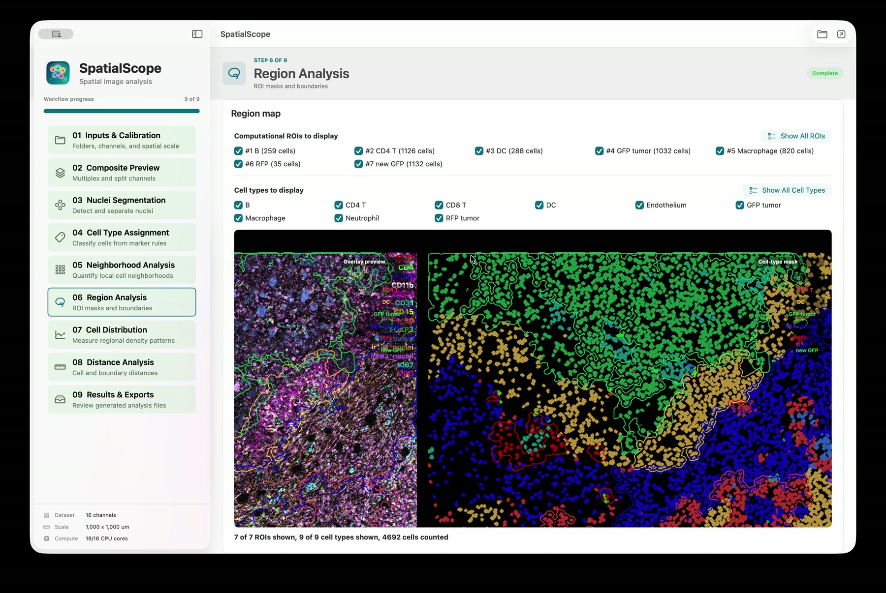

*Figure 12. Computational ROI boundaries shown beside the original overlay and cell-type map.*

For each selected source type, the app creates cell-territory masks, closes gaps, fills holes, removes small components, dilates the retained mask, and keeps components meeting the minimum-cell requirement.

Current-build interpretation details:

- All disconnected retained islands for one source cell type are stored in one ROI record.
- ROI area is the true mask-pixel count × calibrated pixel area.
- A cell is counted when its rounded centroid falls inside the ROI.
- `cellCount` is the sum of assigned, named cell types inside the ROI; Unassigned and Ambiguous cells are excluded.
- The ROI’s displayed dominant type is the most abundant assigned cell type inside it. The source type used to generate a computational ROI remains available separately.
- **Region dominant counts** reports how many saved ROI records are dominated by each cell type. It is a count of ROIs, not cells or disconnected mask islands.

### 10.3 Create or adjust an ROI manually

The manual editor is cell-based. The drawn area selects seed cells by centroid; the polygon itself is not saved directly as the final pixel mask.

Modes:

| Adjustment mode | Result |
|---|---|
| Create new region | Builds a new ROI from cells selected by the drawing |
| Inclusion | Adds newly selected cells to the selected existing ROI’s seed cells, then rebuilds the mask |
| Exclusion | Removes selected cells from the selected existing ROI’s seed cells, then rebuilds the mask |

All modes append an adjusted ROI and preserve the original.

To edit:

1. In **Manual ROI adjustment**, choose the **Adjustment mode**.
2. For Inclusion or Exclusion, choose the **Boundary type to edit**.
3. Enter a unique **New boundary name**.
4. Choose **Polygon** or **Free draw**.
5. Choose which boundaries are visible while editing; use **Show All Boundaries** to restore all of them.
6. Choose the cell type used while editing, or click **Use Target Cell Type**.
7. Tune the manual morphology controls:
   - Manual close: default 2 µm, range 0–30 µm;
   - Manual dilate: default 0 µm, range 0–30 µm;
   - Manual min area: default 0 µm²;
   - Manual min cells: default 1 and applied to each rebuilt connected component; and
   - Manual contour detail: default 1, choices 1, 2, 4, or 8.
8. Draw on the editable cell-type panel:
   - in Polygon mode, click at least three points;
   - in Free draw mode, click and drag.
9. Close the current area with **Close Current Area**, Return, or right-click.
10. Add more closed areas if needed.
11. Review **Adjusted Boundary Preview**.
12. Click **Save Adjusted ROI**.

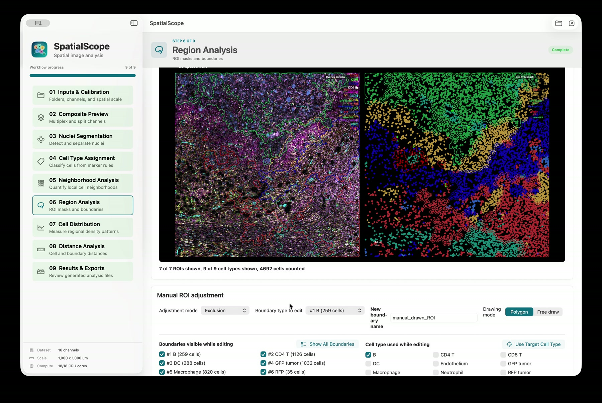

*Figure 13. Manual ROI mode, target, drawing-mode, visible-boundary, and editing-cell-type controls beneath the region map.*

Use **Reset Drawing** to clear all current areas. **Save Adjusted ROI** is enabled only after a valid closed area exists; Inclusion and Exclusion also require an existing target ROI.

Free-draw paths retain their sampled outline when rasterized for centroid selection, so concave selections are preserved. The final ROI is still rebuilt from the selected cells and may change shape when closing, dilation, area, or cell-count filters are applied.

Manual ROI rebuilding uses the same isotropic/disk closing and dilation model as computational Region Analysis. Minimum area and minimum cells are both applied to connected components. If no component survives the selected settings, the app reports an error and does not save an empty or unfiltered fallback ROI.

Saving an adjusted ROI updates the Region Analysis result and boundary registry under `07_region_analysis`; it does not write the adjusted ROI into `08_adjusted_region_analysis`. It also invalidates the in-memory Cell Distribution result. Rerun downstream region-dependent analyses after any ROI change.

### 10.4 Save a customized region display

Under **Customized display and save**:

1. select **Boundaries to include**;
2. select **Cell types to show**;
3. inspect the customized preview; and
4. click **Save Customized Display**.

Use **Use All Boundaries** and **Use All Cell Types** to restore the complete selections.

The app saves both the customized display and an original unmodified comparison under `08_adjusted_region_analysis`. That folder is for these display artifact sets; adjusted ROI analytical results remain under `07_region_analysis`.

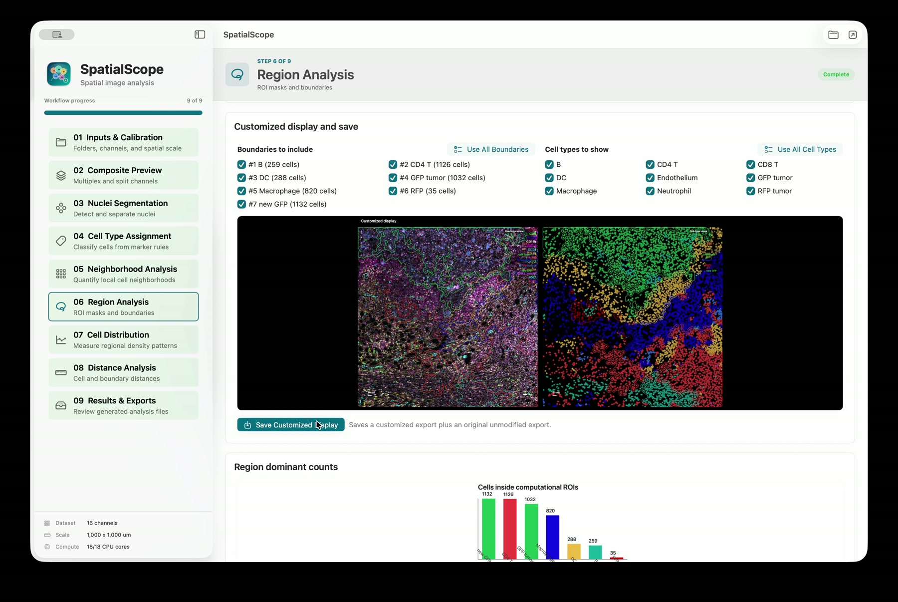

*Figure 14. A customized region comparison with selected cell types and boundaries.*

---

## 11. Step 7 — Cell Distribution

Windows 1.2.4 presents two numbered subsections: **Boundary-banded regions** and **Cell density by boundary distance**. One Windows run generates both linked results from the same boundary and band width. macOS presents the corresponding **Region masks** and **Cell density** tabs separately and also includes **Cell cluster distribution**.

### 11.1 Cell Distribution runtime

The distributed macOS and Windows applications include a self-contained Cell Distribution runtime. macOS bundles architecture-specific helpers; Windows runs the workflow through its private packaged engine. Users do not need a separate Python installation or the legacy TME Spatial project.

Developers rebuilding macOS SpatialScope create the helpers with `script/build_cell_distribution_runtime.sh`; the release package selects the native helper at runtime. Windows developers prepare the engine with `windows/run_native.ps1 setup` and package it with `windows/build_native.ps1 -FullSmoke`.

If a packaged release reports a missing Cell Distribution runtime, reinstall the complete macOS application from the official DMG or rerun the complete Windows setup program. Do not move files out of the `.app` bundle or move `SpatialScope.exe` out of its Windows installation folder.

There is no per-step Cancel button. On Windows, closing SpatialScope performs a bounded shutdown and stops its packaged analysis engine; on macOS, allow the active helper operation to finish.

### 11.2 Generate boundary bands and a density profile

Prerequisites:

- positive X/Y calibration;
- final cell-type assignment; and
- at least one saved Region Analysis boundary mask; and
- the original input folder and configured channel CSVs still accessible at the paths stored in `pipeline_config.json`.

The Region-mask exporter rereads the original CSV matrices. A copied or moved output project writes new results beneath the output folder selected during restore, but the saved input folder must still be available. If the input data moved, update the project configuration before rerunning this step.

Windows procedure:

1. Under **1. Boundary-banded regions**, choose **Boundary from ROI analysis**.
2. Set **Distance band width**. The default is 10 µm.
3. Under **2. Cell density by boundary distance**, select one or more cell types. All assigned types are selected by default and at least one remains selected.
4. Click **Generate boundary bands and density profile**.
5. Inspect both the boundary band map and the multi-series cell-density line plot.

On macOS, generate **Region masks** for the intended boundary and band width first, then open **Cell density**, select cell types, and generate the density plot.

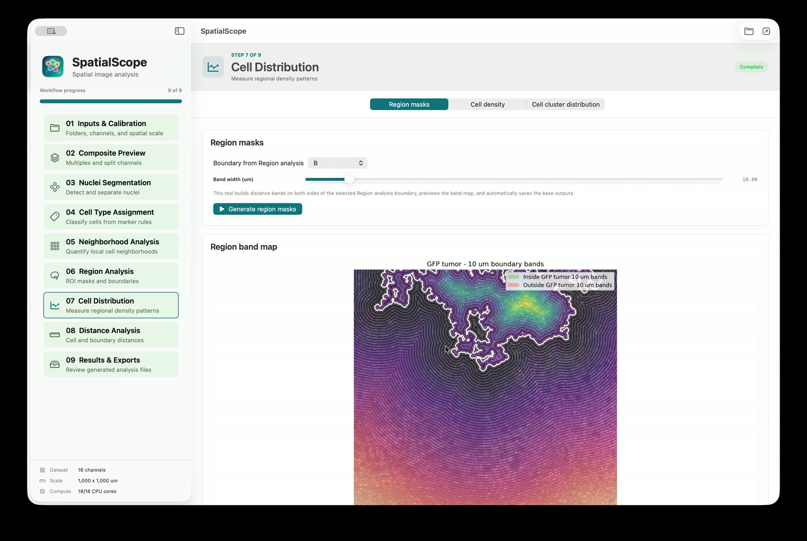

*Figure 15. Distance bands constructed on both sides of a selected ROI boundary.*

The Python workflow computes anisotropic Euclidean distance to the ROI interface, assigns band index `floor(distance / band width)`, and records inside and outside bands separately. Band 0 is the full interval `[0, band width)`: it includes the boundary pixels and every other pixel less than one band width from the interface. The summary reports physical band area.

The outer image frame is removed when Step 7 defines the ROI interface. This differs from Step 8 boundary distance, which includes the outer image frame when it is part of the mask boundary.

### 11.3 Interpret Cell density

Cell density uses the exact signed-distance arrays generated for the displayed boundary band map.

On Windows, changing the boundary, band width, or selected cell types invalidates both linked previews; click **Generate boundary bands and density profile** again. On macOS, regenerate Region masks before density whenever the boundary or band width changes.

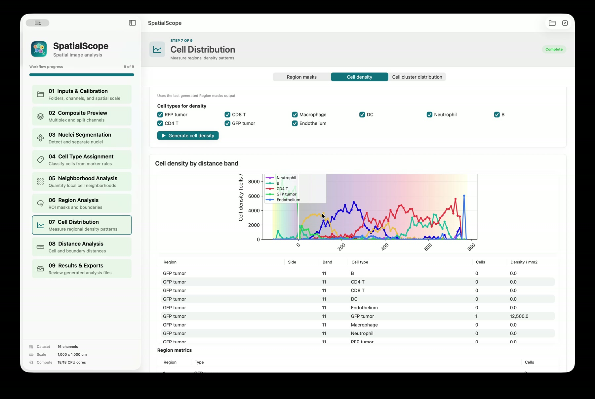

*Figure 16. Cell density plotted as a function of signed distance band.*

For each cell type and band:

```text
density per µm² = cell count / band area in µm²
density per mm² = cell count / (band area in µm² / 1,000,000)
```

Inside distances are plotted as negative and outside distances as positive. Unassigned and Ambiguous cells are excluded by default.

If you change or manually adjust an ROI, rerun Cell Distribution so the band map and density profile use the updated boundary.

### 11.4 Generate Cell cluster distribution (macOS)

The Cell cluster distribution tab is currently exposed by the macOS app. Prerequisites include a completed Neighborhood Analysis. Windows 1.2.4 does not expose this third tab in its native interface.

1. Open **Cell cluster distribution**.
2. Select one or more Region Analysis boundaries. If no explicit selection is stored, the app begins with up to the first three; click **Use All Boundaries** to select every boundary.
3. Select one or more **Neighborhood cluster types**, or click **Use All Clusters**.
4. Click **Generate cell cluster distribution**.
5. Inspect the heatmap, cluster-by-region table, and tile preview.

Only occupied neighborhood tiles are analyzed. A tile is classified:

- inside when more than 50% of its pixels are in the mask;
- outside when fewer than 50% are in the mask; and
- at exactly 50%, by the tile-center pixel.

The full tile and all of its cells are then counted on the chosen side. The exact inside fraction is retained in the output table.

---

## 12. Step 8 — Distance Analysis

Step 8 has **Nearest-neighbor distances** and **Cell-to-boundary distances** tabs.

> **Calibration required for interpretation:** Step 8 does not block a run when calibration is missing. It silently falls back to 1 µm/pixel while still labeling distances as µm. Enter and save valid X/Y calibration before calculating or interpreting any Distance Analysis result.

### 12.1 Nearest-neighbor distances

This mode asks: for each target cell, how far away is the nearest cell of each selected query type?

1. Open **Nearest-neighbor distances**.
2. Choose the **Target cell type**.
3. Select one or more **Query cell types**.
4. Click **Compute nearest-neighbor distances**.
5. Inspect the plot, the first 200 preview rows, paired t-tests, and summary statistics.

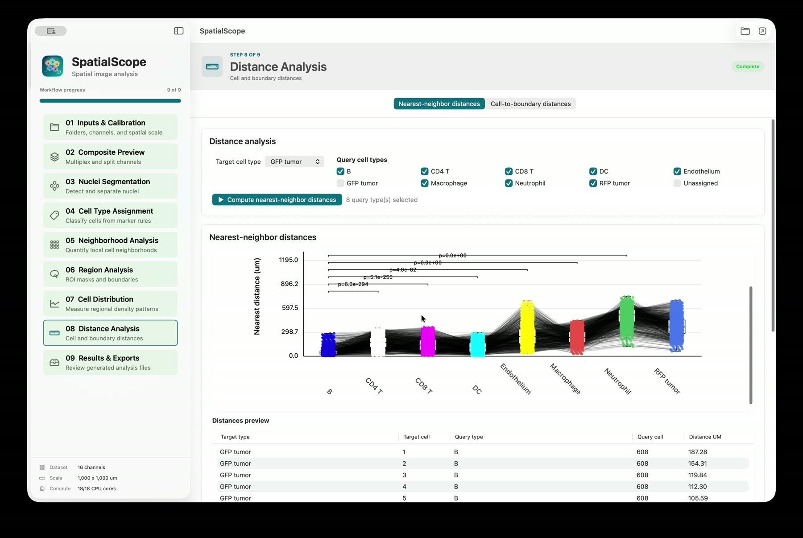

*Figure 17. Nearest-neighbor distance distributions and row-level preview.*

For each target cell and each selected query type, the app finds the nearest distinct query-cell centroid. When target and query types are identical, at least two cells of that type are required so a cell is not matched to itself.

Calibrated distance is:

```text
distance µm = sqrt((Δx px × pixelSizeX)² + (Δy px × pixelSizeY)²)
```

With two query types, the app reports one paired t-test. With more than two, the alphabetically first selected query type is compared with each other selected type. No multiple-testing correction is applied; treat p-values as exploratory.

### 12.2 Cell-to-boundary distances

Prerequisites are final cell-type assignment and at least one saved computational or adjusted ROI mask with dimensions matching the current assignment image.

1. Open **Cell-to-boundary distances**.
2. Choose **Boundary / ROI**.
3. Choose a **Filter**:
   - **All cells**;
   - **Only cells inside region**; or
   - **Only cells outside region**.
4. Select one or more **Query cell types**.
5. Click **Compute boundary distances**.
6. Inspect the plot, row preview, p-value table, and summary.

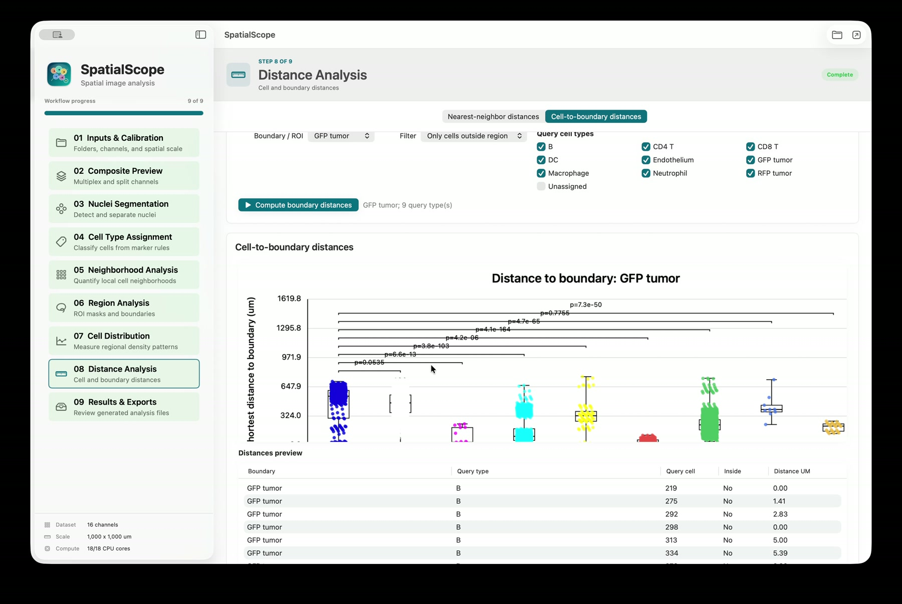

*Figure 18. Cell-to-boundary distance distributions, inside/outside status, and row-level preview.*

Distances are unsigned. The separate **Inside** field records whether each rounded cell centroid lies inside the selected mask. Boundary comparisons between cell types use Welch’s independent-samples t-test. No multiple-testing correction is applied.

The cell-type selector in this step can include **Unassigned** and **Ambiguous**, unlike most other downstream screens.

Nearest-neighbor runtime grows with target cells × query cells × query types. Large datasets or many query types may take substantially longer.

---

## 13. Step 9 — Results & Exports

1. Open **09 Results & Exports**.
2. Click **Refresh** after a run if a new file is not shown.
3. Review the **Name**, **Relative path**, and **Size** columns.
4. Click **Reveal in Finder** on macOS or **Open Output** on Windows to open the output folder in Finder or File Explorer.

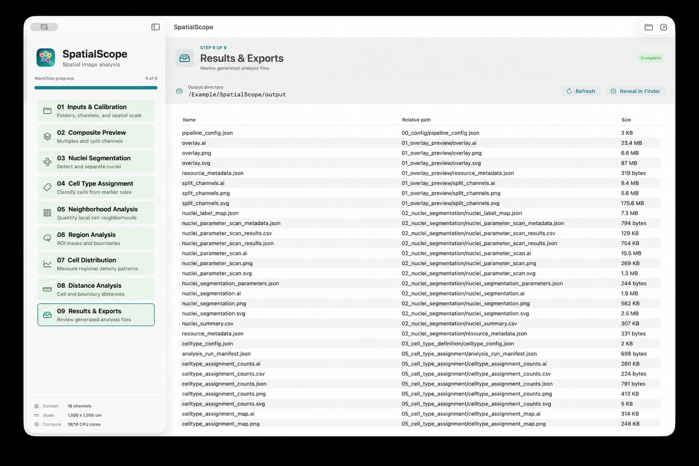

*Figure 19. Recursive list of generated files in an example output directory.*

The table lists all nonhidden regular files recursively and sorts them by relative path. On macOS, use Finder to open an item. On Windows, double-click a file row to open it with the associated application.

Fixed-name outputs are overwritten by a repeated run. Parameterized or hashed files can accumulate, especially for Distance and Cell Distribution. A failed or interrupted operation can leave a partial set of new files beside older files.

---

## 14. Output directory reference

SpatialScope creates the following top-level structure:

```text
00_config/
01_overlay_preview/
02_nuclei_segmentation/
03_cell_type_definition/
04_cell_type_assignment_parameters/
05_cell_type_assignment/
06_neighborhood_analysis/
07_region_analysis/
08_adjusted_region_analysis/
09_distance_analysis/
10_cell_distribution_analysis/
```

`04_cell_type_assignment_parameters` is currently reserved. Final assignment parameters are written in `05_cell_type_assignment`.

| Folder | Principal contents |
|---|---|
| `00_config` | `pipeline_config.json` with absolute paths, channels, calibration, nuclei/assignment modes and parameters, and resources |
| `01_overlay_preview` | Composite and split-channel PNG, AI, and SVG figures; resource metadata |
| `02_nuclei_segmentation` | Final segmentation figures, parameter JSON, label map, nuclei CSV, screening plot/results/metadata |
| `03_cell_type_definition` | Saved `celltype_config.json` |
| `05_cell_type_assignment` | Assignment map and counts figures; row-level CSV/JSON; parameter JSON; 16-bit mask; mask IDs; screening results; manifest |
| `06_neighborhood_analysis` | Neighborhood maps, cluster mask/key/summary, tile tables, parameter files, manifest |
| `07_region_analysis` | Region maps, comparison figures, ROI masks, ROI tables, parameters, boundary registry, manifest |
| `08_adjusted_region_analysis` | Original-unmodified and customized-display artifact sets |
| `09_distance_analysis` | Nearest and boundary figures, row-level tables, t-tests, summaries, parameterized copies, manifest |
| `10_cell_distribution_analysis` | `01_region_masks`, `02_cell_density`, and `03_cell_cluster_distribution` Python-generated artifacts |

### 14.1 Important file meanings

- `pipeline_config.json` is the core input/overlay/nuclei/assignment configuration. Both platforms use it when recognized results are selected again. The Windows app also reads its atomic workflow manifest and validated artifacts to restore completed stages, previews, recommendations, and exports; `pipeline_config.json` alone does not contain the complete downstream workflow state.
- Saved input paths are absolute. After input data is moved, reselect the input folder and save the configuration. On Windows, selecting a copied or moved output folder keeps the folder chosen in the current dialog as the output destination, but downstream steps can still require access to the original input CSV path until configuration is saved again.
- `nuclei_summary.csv` contains label, X/Y centroid in pixels, area in pixels, and normalized mean intensity.
- Exported nucleus and cell centroids use zero-based pixel coordinates with the origin at the input matrix’s top-left; X increases rightward and Y increases downward. Label maps and masks use the same row-major orientation.
- `nuclei_label_map.json` contains the full per-pixel nucleus label map and can be large.
- `celltype_assignments.csv` and `.json` contain per-nucleus assignment results and marker evidence.
- `celltypes_mask_uint16.tiff` uses 0 for background and 1...N for configured cell types. Unassigned and Ambiguous cells have no configured cell-type ID.
- `neighborhood_tiles.csv` and `.json` contain occupied tile assignments and counts.
- `boundary_mask_registry.json` links Region Analysis boundaries to their saved mask files.
- `regions.csv` and `.json` contain ROI geometry and counts. Their `centroidX` and `centroidY` values are the center of the mask’s bounding box, not an area-weighted centroid of all mask pixels.
- `resource_metadata.json` records core counts, requested workers, and observed CPU/GPU state.
- `analysis_run_manifest.json` records completion status and expected files for the native analysis step.

### 14.2 Export formats

- **PNG:** raster figure with 300 DPI metadata.
- **SVG:** vector or vector-wrapped figure suitable for scalable viewing and, where supported, editing.
- **AI:** an Illustrator-compatible PDF stream stored with an `.ai` extension, not native Illustrator object data.
- **TIFF:** raster image or 8/16-bit analytical mask.
- **CSV:** row-level and summary tables for spreadsheet/statistical use.
- **JSON:** parameters, structured results, registries, and manifests.
- **NPZ:** NumPy arrays for Cell Distribution band masks and distances.
- **RAW:** custom 16-bit mask data with an `SSU16R1` header, dimensions, and little-endian values.

---

## 15. Reproducibility and data-management guidance

### 15.1 Keep one output folder per dataset and run

Do not point a new input dataset at an old output folder. On Windows, selecting an old output folder automatically restores its recognized history; use a new empty folder for a new run. Changing the input path invalidates downstream results but may leave previews visible until they are recomputed. For a guaranteed clean session, choose the new paths, quit and reopen the app, confirm or reselect those paths, and rerun every step in order.

### 15.2 Save configuration and cell types explicitly

- Click **Save Configuration** after editing Step 1.
- Click **Save Cell Types** after editing marker rules.
- Final analysis buttons save their own outputs automatically.

### 15.3 Rerun downstream steps after upstream changes

| Change | Rerun at minimum |
|---|---|
| Calibration or input data | Steps 2–8 |
| Channel/marker names | Steps 2–8, including updating and resaving Marker Rules |
| Nuclei parameters | Steps 3–8 |
| Cell-type rules or assignment parameters | Steps 4–8 |
| Neighborhood square size | Step 5 and the macOS Cell cluster distribution tab |
| ROI parameters or adjusted ROI | Step 6, Step 7, and boundary-dependent Step 8 analyses |
| Region-mask band width | Windows: rerun Cell Distribution once; macOS: rerun Region masks, then Cell density |

### 15.4 Record validation decisions

For a reproducible study, record:

- source image/export version;
- CSV dimensions and physical field size;
- selected nucleus channel;
- why the final nuclei parameters were accepted;
- cell-type rule definitions;
- how Unassigned and Ambiguous rates were evaluated;
- neighborhood grid size;
- ROI-defining cell types and morphology parameters;
- manual ROI names and adjustment rationale;
- boundary band width; and
- target/query types and filters for each distance analysis.

The output JSON and metadata files preserve numerical settings, but they do not replace scientific validation notes.

### 15.5 Validate screening recommendations

Nuclei screening maximizes detected count. Assignment screening minimizes unresolved classifications. Neither objective measures ground-truth biological accuracy.

Before accepting a recommendation:

1. inspect multiple representative spatial areas;
2. compare with expected morphology and marker biology;
3. quantify false positives, false negatives, merges, and fragments on a manually reviewed subset; and
4. prefer a stable parameter region over an isolated extreme score.

---

## 16. Troubleshooting

| Symptom or message | Likely cause | What to do |
|---|---|---|
| No CSV files found | Wrong folder, files in subfolders, or non-CSV extension | Put top-level `.csv` files in the chosen input folder and rescan |
| `file did not contain a numeric matrix` | Empty file or no parsed rows/tokens | Export a headerless numeric matrix as UTF-8 CSV |
| `<file>` has shape `A×B`, expected `C×D` | Channel matrices have different dimensions | Re-export/crop/resample all channels to identical dimensions before use |
| Scale says Not set | One or more calibration values are zero/nonpositive | Enter positive X/Y physical and pixel dimensions |
| Overlay is unexpectedly nonempty after clearing every box | All-off state falls back to all channels | Leave only the intended Overlay boxes selected |
| White overlay has no effect | Weight is zero, or some Overlay boxes are selected but the white channel is not one of them | Raise White weight and include that channel among the selected Overlay channels |
| Wrong nucleus channel | Automatic name guess selected another channel | Choose the intended nucleus channel manually |
| Nuclei are merged | Blur/threshold creates connected foreground; no literal watershed split is implemented | Reduce blur, tune threshold-related controls, or improve the nucleus source channel |
| Changing Local window changes nothing | The parameter is unused in the current nuclei analyzer | Do not rely on it until implementation is added |
| Advanced nuclei recommendation is fragmented | Count-maximization favors many components | Inspect other high-performing rows and apply a visually validated combination |
| Assignment asks for final nuclei result | Final nuclei segmentation has not been run in the current/output context | Run Step 3 final segmentation |
| Many Unassigned cells | Rules too strict, marker threshold too strict, or insufficient positive pixels | Verify marker names/rules, lower minimum positive pixels, or retune thresholding |
| Many Ambiguous cells | Rules overlap or winning thresholds are strict | Add biologically justified negative rules, increase specificity, or cautiously relax probability/gap thresholds |
| Assignment Local looks identical to Otsu | Current Local mode uses Global Otsu | Use Otsu or Yen; do not expect local adaptation in this build |
| Region analysis has fewer ROIs than visible islands | All islands for one source type are aggregated into one ROI record | Interpret ROI records by source type and inspect the saved mask |
| Manual drawing selects no cells | No eligible cell centroid lies inside the closed area | Close a valid area around visible seed-cell centroids and verify the editing cell type |
| Free-draw boundary misses the intended edge | The sampled free-draw path is preserved, including concave sections, but a sparse or open stroke can still miss the intended area | Draw one continuous closed path with enough points around the intended boundary, or use Polygon mode for precise corners |
| Cell Distribution says resolution is required | Calibration is missing | Enter and save all four calibration values |
| Distance Analysis reports µm despite missing scale | Step 8 silently fell back to 1 µm/pixel | Enter and save valid X/Y calibration, then rerun the distance analysis |
| Cell Distribution runtime error | The application package is incomplete, damaged, or from an unsupported build | Reinstall the complete app from the official DMG or rerun the complete Windows installer; source builders should rebuild the bundled runtime |
| Step 7 fails after moving/copying a run | `pipeline_config.json` still stores the original absolute CSV path | Restore access to the original inputs or reselect the input/output folders and save configuration |
| Cell density uses the wrong boundary/band width | On Windows, the selected boundary or band-width control does not match the intended analysis; on macOS, Cell density loads the most recently modified Region masks arrays | Windows: select the intended boundary and band width, then rerun Cell Distribution. macOS: regenerate the intended Region masks immediately before density |
| No boundary masks found | No Region Analysis mask has been saved | Run computational ROI identification or save an adjusted ROI |
| Boundary mask size mismatch | Mask and current assignment image come from different datasets/dimensions | Use one output folder per dataset and rerun Region Analysis |
| Old results remain visible after changing input | Input/output selection does not clear every downstream result | Choose fresh paths, restart the app, confirm the paths, and rerun the workflow |
| On macOS, choosing an output folder changes current settings | Prior `pipeline_config.json` was automatically imported | Choose the output folder before editing, or use a new empty folder |
| New output file not shown | Results list is stale | Click **Refresh** in Step 9 |

---

## 17. Implementation and interpretation notes

This section documents implementation behavior that may differ from expectations created by familiar analysis terminology.

### 17.1 Nuclei threshold formula

After normalization and box-blur preprocessing, the current global threshold factor is:

```text
F = 0.56
    + 2.0 × localOffset
    + 0.18 × hMaxima
    + 0.012 × seedMinimumDistance
    + 0.018 × watershedCompactness
    - 0.010 × postResplit

threshold = clamp(mean + standardDeviation × F, 0.01, 0.98)
```

Four-connected components are accepted using diameter-derived area limits. `LOCAL_WIN_UM` is stored and screened but is not read by this calculation.

### 17.2 Assignment thresholding and probabilities

- Global Otsu and Local currently produce the same threshold.
- Yen uses a distinct threshold.
- Top-hat and Gaussian-named controls use box blurs.
- Each marker channel is normalized between its 1st and 99.8th percentiles before background subtraction, blur, thresholding, and four-connected positive-object filtering.
- Marker positivity is based on retained positive pixels in the sampled cell territory.

For a marker, with `s = max(minimumPositivePixels, 1)`, evidence is scored as:

```text
markerScore =
    0.65 × (1 − exp(−positivePixels / s))
  + 0.35 × (1 − exp(−summedIntensity / max(1, s/2)))
```

A cell type’s evidence is the geometric mean of its required-positive scores, the complements of negative-marker scores, and the maximum score in each Any-positive OR group. Scores are normalized only across eligible types. If exactly one type is eligible, it receives probability 1 and bypasses the winning-probability and probability-gap thresholds. These values are heuristic relative evidence scores, not calibrated probabilities.

### 17.3 Region records

Automated Region Analysis aggregates all retained disconnected mask islands for one source cell type into one ROI record. Contour downsampling changes only display/export contours, not the analytical mask. Region `centroidX`/`centroidY` fields are the center of the mask bounding box rather than an area-weighted mask centroid.

### 17.4 Cell Distribution portability and cancellation

Step 7 is self-contained in both distributed applications. macOS selects the bundled helper matching the Mac's architecture; Windows uses the private packaged analysis engine. There is no per-step Cancel button. Closing the Windows app stops its owned engine after a bounded shutdown; on macOS, allow the active helper operation to finish.

### 17.5 Statistical interpretation

- Nearest-neighbor multi-query comparisons use the alphabetically first selected query type as reference.
- Boundary comparisons use Welch’s t-test.
- No multiple-testing correction is applied.
- The tests treat cell-level distances as observations, although neighboring cells can be spatially autocorrelated and cells from one image are not independent biological replicates.
- P-values are exploratory and do not establish biological importance. Report distributions and effect sizes, and perform replicate-level inference where possible.

---

## 18. Glossary

| Term | Meaning in SpatialScope |
|---|---|
| Assigned cell | A segmented nucleus given one configured cell type |
| Ambiguous | More than one cell-type rule is eligible and ambiguity criteria do not permit a winner |
| Boundary band | A distance interval on the inside or outside of an ROI interface |
| Cell territory | Pixels associated with a nucleus for marker evidence and cell-type visualization |
| Cluster | In Neighborhood Analysis, the exact set of assigned cell types present in an occupied grid tile |
| Component | A connected group of foreground/mask pixels |
| Nucleus | A connected object accepted by final nuclei segmentation; also a generated marker for cell-type rules |
| Overlay | Color-combined image of selected marker channels |
| Query type | Cell type searched for when measuring nearest-neighbor or boundary distances |
| ROI | Region of interest represented by a saved mask and boundary |
| Target type | Cells from which nearest-neighbor distances are measured |
| Unassigned | No cell-type rule is eligible for the nucleus |

---

*End of manual.*
